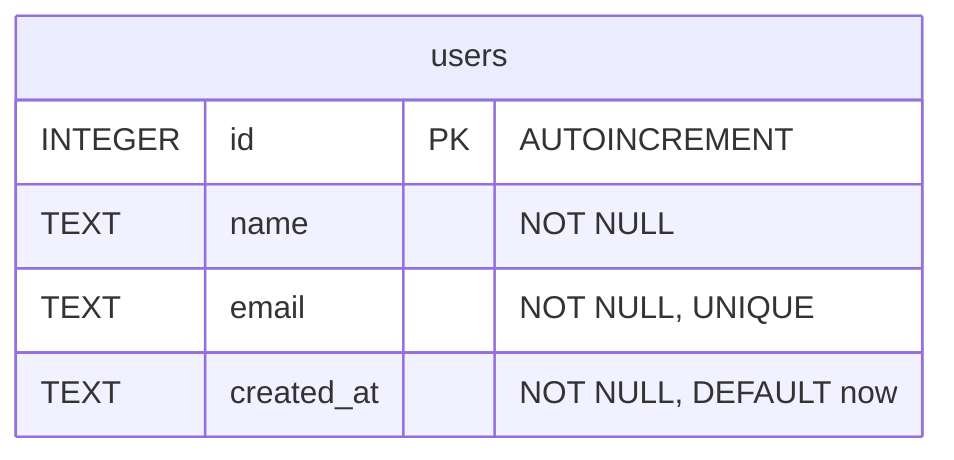

# Database Schema — Users

## ERD

```text
┌──────────────────────────────────────────┐
│  users                                   │
├──────────────────────────────────────────┤
│  id         INTEGER  PRIMARY KEY AUTO    │
│  name       TEXT     NOT NULL            │
│  email      TEXT     NOT NULL UNIQUE     │
│  created_at TEXT     NOT NULL            │
│             DEFAULT (datetime('now'))    │
└──────────────────────────────────────────┘
```

## Notes

- Single table (`users`) — the project needs no relationships, so **no foreign
  keys** are required (per the PRD: do not create relationships the project
  does not need).
- Every record is uniquely identified by `id` (primary key).
- `email` is enforced as unique by the database, so duplicate email addresses
  are rejected even if application code fails to check.
- `name` and `email` are `NOT NULL` — a record cannot be inserted without them.

## Mermaid (for rendering in editors that support it)



## DDL

```sql
CREATE TABLE IF NOT EXISTS users (
  id         INTEGER PRIMARY KEY AUTOINCREMENT,
  name       TEXT    NOT NULL,
  email      TEXT    NOT NULL UNIQUE,
  created_at TEXT    NOT NULL DEFAULT (datetime('now'))
);
```